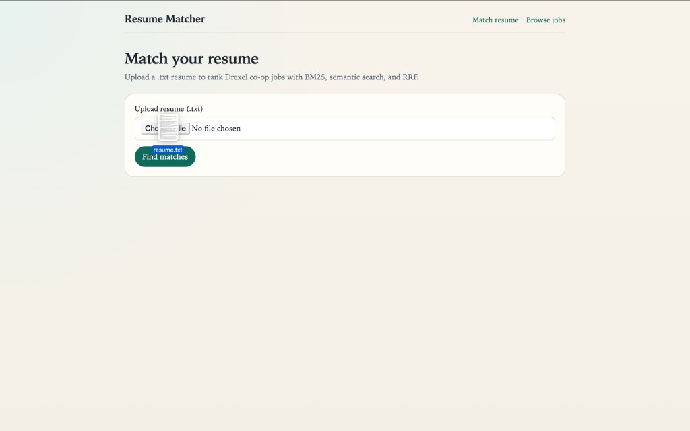
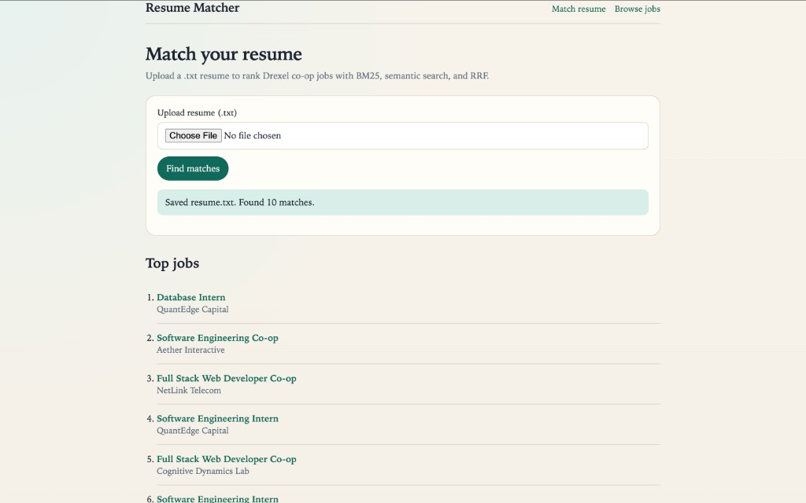
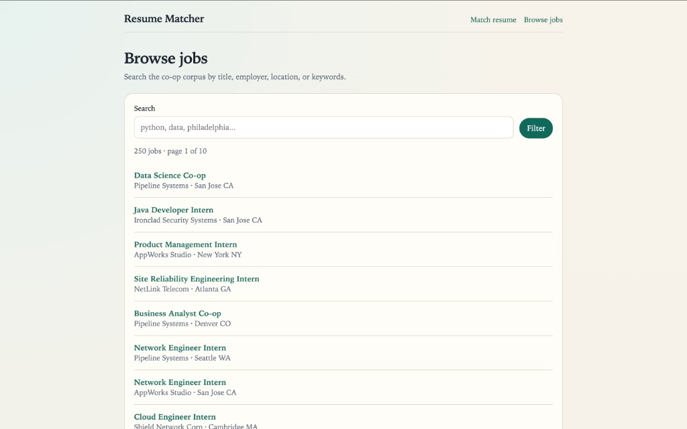

# Resume Matcher

Django app that ranks internship and co-op postings against an uploaded resume.

The resume is the query. A CSV of job postings is the corpus. Matching uses:

1. **BM25** for keyword overlap
2. **Sentence embeddings** (`all-MiniLM-L6-v2`) stored in **Chroma** for meaning
3. **Reciprocal Rank Fusion (RRF)** to merge the two ranked lists into one top 10

No OpenAI key is required. Embeddings run locally.

## Screenshots

| Upload resume | Ranked matches |
| --- | --- |
|  |  |

| Browse jobs |
| --- |
|  |

## Pages

- `/` — upload a `.txt` resume and see ranked matches
- `/jobs/` — browse the corpus with search and pagination
- `/jobs/<id>/` — job detail (description, qualifications, location)

## Setup

```bash
cd Resume_Matcher
python3 -m venv venv
source venv/bin/activate
python3 -m pip install -r requirements.txt
python3 manage.py migrate
python3 manage.py runserver
```

Open [http://127.0.0.1:8000/](http://127.0.0.1:8000/).

For a quick test, upload `data/sample_resume.txt`.

The first match can take a minute while the embedding model downloads and jobs are indexed. Later runs reuse `data/vector_db/`.

## Data

Jobs load from `data/jobs/sample_jobs.csv`. That file is a fictional internship and co-op list included in this repo.

To use your own CSV, keep those headers and point `JOBS_CSV` in `matcher/bm25_search.py` at the new file. Then delete `data/vector_db/` so the index rebuilds.

## Project layout

```text
matcher/bm25_search.py      # load CSV + BM25
matcher/vector_search.py    # Chroma embeddings
matcher/rrf.py              # merge ranks
matcher/views.py            # upload, browse, detail
data/jobs/sample_jobs.csv   # public sample corpus
```

## Notes

- Resume upload currently accepts `.txt` only
- Do not commit real resumes or private job exports
